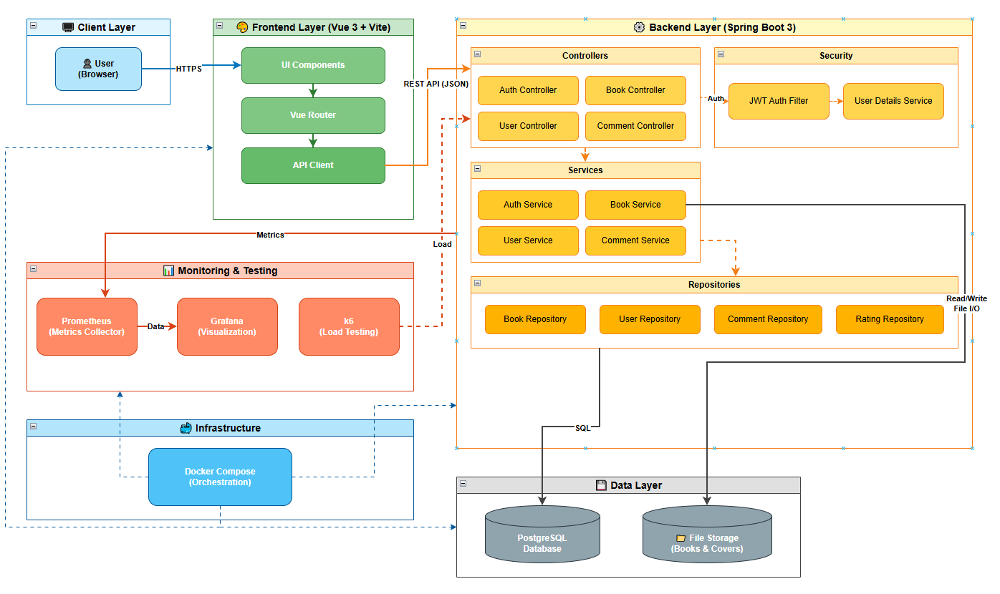
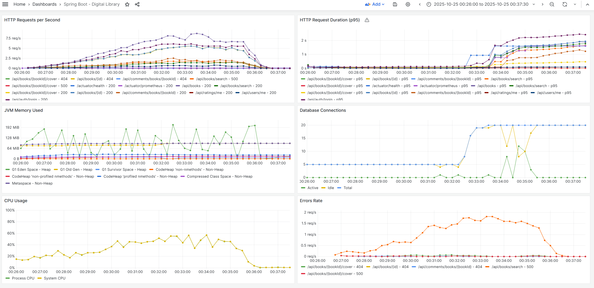

#  Digital Library

Цифровая библиотека — полноценное веб-приложение для хранения, поиска, чтения и обсуждения книг с поддержкой рейтингов, комментариев, закладок и административной панели.

## 📁 Структура проекта

- [`digital-library-backend/`](digital-library-backend/) — Spring Boot 3 (Java) API
- [`digital-library-frontend/`](digital-library-frontend/) — Vue 3 + Vite клиент
- [`docker/`](docker/) — Docker Compose, мониторинг (Prometheus + Grafana), нагрузочные тесты (k6)


---

## 🚀 Быстрый старт

### Требования
- Docker и Docker Compose

> 💡 **Примечание:** Этот `docker-compose.yml` предназначен для **обычного развёртывания приложения**, а не для нагрузочного тестирования. Ограничения ресурсов (CPU/память) **не заданы**.

### Подготовка базы данных

Приложение использует **Flyway** для управления миграциями и **JPA/Hibernate** для генерации схемы. Чтобы корректно инициализировать БД с тестовыми данными, выполните следующие шаги:

1. **Первый запуск (создание схемы):**  
   Во время первого запуска **отключите Flyway** и разрешите Hibernate создать таблицы:  
   [`docker/application-docker.properties`](docker/application-docker.properties)
   ```properties
   # docker/application-docker.properties
   spring.jpa.hibernate.ddl-auto=create
   spring.flyway.enabled=false
   ```
   Запустите контейнеры:
   ```bash
   cd docker
   docker compose up --build
   ```
   После того как приложение запустится и создаст таблицы — **остановите** контейнеры (`Ctrl+C`).

2. **Включение миграций и загрузка данных:**  
   Измените конфигурацию:
   ```properties
   # docker/application-docker.properties
   spring.jpa.hibernate.ddl-auto=none
   spring.flyway.enabled=true
   spring.flyway.baseline-on-migrate=true
   ```
   Поместите SQL-файл с тестовыми данными (например, `init-data.sql`) в папку `docker/postgres/`. Он автоматически выполнится при следующем запуске, так как PostgreSQL запускает все `.sql`-файлы из `/docker-entrypoint-initdb.d/`.

3. **Финальный запуск:**
   ```bash
   docker compose up --build
   ```

> 📌 **Важно:** Файл `init-data.sql` должен содержать **только данные** (INSERT), а не DDL (CREATE TABLE), так как таблицы уже созданы либо Hibernate’ом, либо Flyway-миграциями.
> 
> тестовый админ если решили оставить данные из примера: Pedro/qwerty

### Запуск приложения

```bash
cd docker
docker compose up --build
```

После запуска:

- **Frontend (Vue)**: http://localhost
- **Backend API**: http://localhost/api
- **Grafana (мониторинг)**: http://localhost:3000 (`admin` / `admin`)
- **Prometheus**: http://localhost:9090

> 🔐 **JWT и пароли:**  
> Убедитесь, что в корне папки `docker/` создан файл `.env` с переменными:
> ```env
> DB_PASSWORD=your_secure_db_password
> JWT_SECRET=your_strong_jwt_secret
> ```


## 🧩 Архитектура



## 🗃️ База данных

Полная физическая схема:


> Подробное описание бизнес-логики — в [backend README](digital-library-backend/README.md).


## 📊 Нагрузочное тестирование

Результаты нагрузочного тестирования, проведенного с помощью k6 и визуализированные в Grafana
### 🧪 Тестовые параметры
*   **Инструмент:** [k6](https://k6.io/)
*   **Продолжительность:** 10 минут (разогрев → рост → плато → спад)
*   **Пиковая нагрузка:** 50 виртуальных пользователей (VUs)
*   **Цель:** Моделирование реального трафика: 70% гостей, 30% авторизованных пользователей, сценарии просмотра книг, поиска, комментариев и профиля.
*   **Инфраструктура:** Docker Compose с явным ограничением ресурсов:
    *   **Backend:** 2 ядра CPU, 1 ГБ памяти.
    *   **PostgreSQL:** 1 ядро CPU, 512 МБ памяти.

### 📈 Ключевые результаты (при ограничении ресурсов)

| Метрика | Результат | Комментарий |
| :--- | :--- | :--- |
| **Макс. RPS (запросов в секунду)** | **~7-8 RPS** | Система стабильно обрабатывает до 8 запросов в секунду. Это **реальный предел** для текущей конфигурации. |
| **Время отклика (p95)** | **< 1.5 секунд** (в среднем) / **до 2.5 секунд** (на пике) | 95% запросов выполняются менее чем за 1.5 секунды. На пиковой нагрузке время отклика растет — это ожидаемое поведение при достижении лимита ресурсов. |
| **Загрузка CPU (Backend)** | **До 60%** | Процессор не был узким местом, но работал на высокой загрузке. Запас мощности небольшой. |
| **Использование памяти (JVM)** | **Около 128 MiB** | Память использовалась очень экономно. Лимит в 1 ГБ не был достигнут, что говорит о хорошем управлении памятью. |
| **Соединения с БД** | **До 20 активных** | Соединения распределены равномерно. Нет перегрузки БД. |


> 📌 **Графики нагрузочного теста доступны в Grafana после запуска `docker-compose up`.**



---

## 📖 Документация по компонентам

- [Backend README](digital-library-backend/README.md)
- [Frontend README](digital-library-frontend/README.md)
