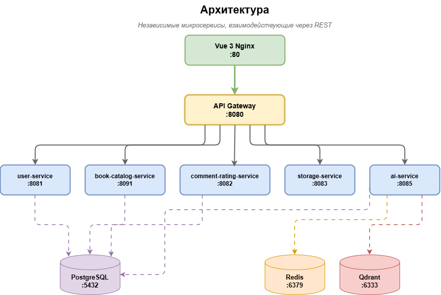

# Digital Library

Цифровая библиотека — веб-приложение для хранения, поиска, чтения и обсуждения книг с AI-ассистентом, системой рекомендаций и встроенной онлайн-читалкой FB2.


---

## Что умеет система

- **Читалка** — встроенный FB2-ридер прямо в браузере, сохранение позиции чтения
- **AI-чат** — диалог с ассистентом по содержанию конкретной книги или по всей библиотеке; понимает контекст серий (Ведьмак, Гарри Поттер и т.п.)
- **Умные рекомендации** — персональные и на основе истории чтения; поиск похожих книг по векторному сходству
- **Каталог** — поиск по названию, автору, жанру, тегам; обложки, метаданные, рейтинги
- **Комментарии и рейтинги** — отзывы на книги с soft-delete и модерацией
- **Закладки** — сохранение позиции в тексте с привязкой к главе
- **Администрирование** — загрузка книг, управление пользователями, ролевой доступ
- **Мониторинг** — Prometheus метрики, Grafana дашборды

---

## Архитектура

Система построена как набор независимых микросервисов, взаимодействующих через REST. Единая точка входа — API Gateway.




Подробнее: [docs/ARCHITECTURE.md](docs/ARCHITECTURE.md)

---

## Стек технологий

| Сервис                 | Язык / Фреймворк                        | БД / Хранилище            | Порт |
| ---------------------- | --------------------------------------- | ------------------------- | ---- |
| api-gateway            | Java 21, Spring Cloud Gateway 2024      | —                         | 8080 |
| user-service           | Java 21, Spring Boot 3.4, JPA, Security | PostgreSQL                | 8081 |
| comment-rating-service | Java 21, Spring Boot 3.4, OpenFeign     | PostgreSQL                | 8082 |
| storage-service        | Java 21, Spring Boot 3.4, JJWT          | Файловая система          | 8083 |
| book-catalog-service   | Java 21, Spring Boot 3.4, OpenFeign     | PostgreSQL                | 8091 |
| ai-service             | Python 3.11, FastAPI, PyTorch           | Qdrant, Redis, PostgreSQL | 8085 |
| frontend               | Vue 3, Vite 7, Axios                    | —                         | 80   |

AI-стек: `sentence-transformers` (модели `ru-en-RoSBERTa` для рекомендаций, `USER-bge-m3` для RAG), `Qdrant` (векторный поиск), `DeepSeek API` (генерация ответов), `Redis` (история диалогов, кэш).

---

## Быстрый старт

### Требования

- Docker и Docker Compose
- Папка с FB2-книгами (укажите путь в `docker-compose-microservices.yml`)


## Документация

| Раздел                               | Файл                                         |
| ------------------------------------ | -------------------------------------------- |
| Бэкенд — обзор сервисов              | [docs/BACKEND.md](docs/BACKEND.md)           |
| Фронтенд                             | [docs/FRONTEND.md](docs/FRONTEND.md)         |
| Архитектурные решения                | [docs/ARCHITECTURE.md](docs/ARCHITECTURE.md) |
| Алгоритмы (RAG, рекомендации, поиск) | [docs/ALGORITHMS.md](docs/ALGORITHMS.md)     |
| Схема базы данных                    | [docs/DATABASE.md](docs/DATABASE.md)         |
| Сценарии использования               | [docs/USE_CASES.md](docs/USE_CASES.md)       |
| API Reference                        | [docs/api/](docs/api/)                       |
| Описание сервисов                    | [docs/services/](docs/services/)             |
| Демо AI-ассистента                   | [docs/services/ai-service.md](docs/services/ai-service.md#🎥-демонстрация-ai-ассистента) |

---

## Структура репозитория

```
digital-library-frontend/   Vue 3 приложение
services/
  api-gateway/              Spring Cloud Gateway
  user-service/             Аутентификация, профили, история чтения
  book-catalog-service/     Каталог книг, авторы, жанры
  comment-rating-service/   Комментарии, рейтинги, закладки
  storage-service/          Хранение и раздача файлов (.fb2, обложки)
  ai-service/               RAG-чат, рекомендации, векторизация
shared/
  common-models/            Общие классы (JWT, исключения, security)
docs/                       Документация
docker-compose.yml          Основной docker-compose файл для запуска всей инфраструктуры
docker-compose-microservices.yml Альтернативный файл запуска без AI
```

---


