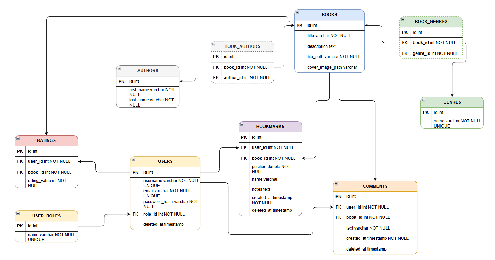

## 🛠️ Стек технологий

### 📌 Краткий обзор (бейджи)

  
  
  
  


---

### 📋 Подробный список

- **Язык**: Java 17
- **Фреймворк**: Spring Boot 3.5.6
- **Веб**: Spring Web (REST API)
- **Безопасность**: Spring Security + JWT (`io.jsonwebtoken:jjwt-*`)
- **База данных**: PostgreSQL **17** (в продакшене), H2 (для тестов)
- **ORM**: Spring Data JPA (Hibernate)
- **Миграции**: Flyway (`flyway-core`, `flyway-database-postgresql`)
- **Валидация**: Jakarta Bean Validation
- **DTO-маппинг**: MapStruct 1.5.5.Final
- **Утилиты**: Project Lombok 1.18.30
- **Мониторинг**: Spring Boot Actuator + Micrometer → Prometheus
- **Тестирование**: JUnit 5, Spring Boot Test, H2 для тестов
- **Сборка**: Maven


---

##  Описание бизнес-логики и ключевых сценариев

Ниже приведены правила, которые неочевидны из кода, но критичны для понимания работы системы.

### 🧑‍💼 Роли пользователей и их права

- **GUEST** — неавторизованный пользователь. Может просматривать каталог книг, читать и скачивать (если разрешено), но не может оставлять комментарии, ставить оценки или создавать закладки.
- **USER** — авторизованный читатель. Может оставлять **один активный комментарий на книгу**, ставить/изменять оценку (1–5), управлять своими закладками.
- **MODERATOR** — может управлять книгами, авторами и жанрами, а также модерировать комментарии (мягко удалять/восстанавливать).
- **ADMIN** — полный доступ: управление пользователями (мягкое удаление, восстановление, смена ролей), модерация всего контента, просмотр аудита.


### 🗑️ Мягкое удаление

- Пользователи, комментарии и закладки поддерживают **мягкое удаление** через поле `deleted_at`.
- Удалённые записи **исключаются из бизнес-логики**, но сохраняются в БД для целостности (например, оценки удалённых пользователей продолжают учитываться в среднем рейтинге книги).

### 🔒 Уникальность среди активных записей

- `username` и `email` уникальны **только среди активных пользователей** (`deleted_at IS NULL`).  
  Реализовано с помощью **частичных (partial) уникальных индексов** в PostgreSQL.

### 💬 Комментарии

- Один пользователь может иметь **только один активный комментарий на одну книгу**.  
  Обеспечивается уникальным частичным индексом:
  ```sql
  CREATE UNIQUE INDEX idx_comment_unique_active ON comment (user_id, book_id) WHERE deleted_at IS NULL;
  ```

### ⭐ Рейтинги

- Оценка **не может быть удалена**, только **изменена** (новое значение заменяет старое).
- После удаления пользователя его оценки **сохраняются** — это необходимо для корректного расчёта среднего рейтинга.

### 📚 Удаление книги

- Книга удаляется **физически**.
- Все связанные сущности (`Comment`, `Rating`, `Bookmark`, связи с авторами и жанрами) удаляются **каскадно**.
- Обоснование: без книги связанные данные теряют смысл, и физическое удаление упрощает поддержку целостности.

---

Это описание фокусируется на неочевидных, но важных аспектах логики и может быть включено в README как раздел «Бизнес-правила».

## 🗃️ Схема базы данных



> Все связи, индексы и ограничения описаны в миграциях Flyway (`V1__add_partial_unique_indexes.sql`).

[//]: # (## 🧩 Диаграмма сущностей &#40;Entity Class Diagram&#41;)

[//]: # ()
[//]: # (![Entity Diagram]&#40;../docs/backend-entities.png&#41;)

[//]: # ()
[//]: # (> Сущности находятся в пакете `org.nahap.digital_library_backend.entity`.)
