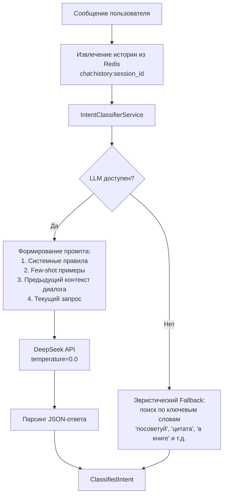
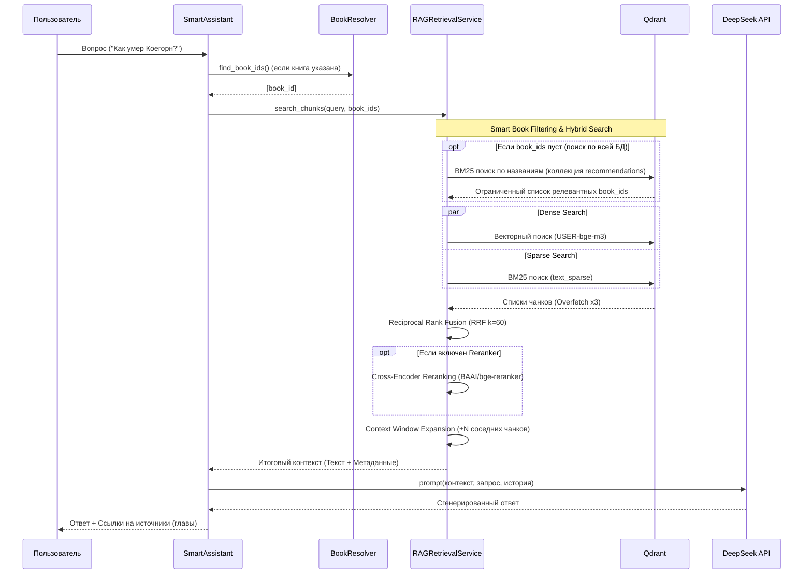
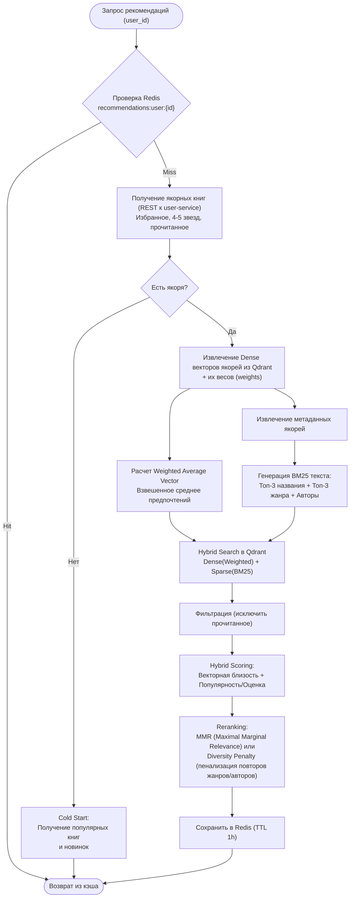

# 🧠 Алгоритмы и подходы

> [!NOTE]
> Основная интеллектуальная логика (RAG, рекомендации, семантический поиск, классификация запросов) реализована в **ai-service** (Python 3.11 / FastAPI). Остальные сервисы обращаются к нему через REST API. Ниже подробно описаны алгоритмы, скрытые под капотом.

---

## 💬 1. Классификация намерений (Intent Classification)

Каждое текстовое сообщение пользователя классифицируется для определения того, что именно он хочет сделать. За это отвечает `IntentClassifierService`.

### 🔄 Процесс классификации

Для максимально точного понимания контекста система использует **Один вызов LLM** (DeepSeek API) с few-shot промптингом, а в случае недоступности API моментально переключается на эвристический подход (keyword matching).

### 🎯 Структура ClassifiedIntent
LLM не просто определяет категорию, но и извлекает мощный набор параметров из естественного языка:
* **Тип интента**: `book_question` (вопрос по сюжету), `recommendation` (поиск книг), `quote_search` (поиск точной цитаты) или `general`.
* **Разрешение местоимений (Coreference Resolution)**: Если пользователь пишет _«А что с ней стало в конце?»_, LLM заглядывает в `Предыдущий контекст диалога`, понимает, что речь идет о конкретном персонаже конкретной книги, и генерирует `clean_query` = _«Что стало с [Имя персонажа] в конце»_, а также извлекает `title` и `author` книги.
* **Scope (Область поиска)**:
  * `book` — названа конкретная книга (искать только в ней).
  * `series` — назван только цикл или автор (искать по всем книгам автора/цикла).
* **NLP-фильтры рекомендаций**: LLM преобразует свободный текст (_«что-то легкое на вечер про любовь»_) в строгие параметры: `genres=['Современная проза']`, `mood='легкое'`, `min_word_count=20`, `max_word_count=80`. Также извлекает книги-эталоны в `similar_to_books`.

---

## 🔎 2. RAG Pipeline (Поиск и генерация ответов)

Ответы на вопросы по содержанию книг формируются с помощью Retrieval-Augmented Generation (RAG). Оркестрация происходит в `SmartAssistantService` и `RAGRetrievalService`.

### 🔄 Полная схема RAG

### 🧠 Ключевые механизмы RAG

1. **Two-Stage Retrieval (Smart Book Filtering)**: Если пользователь задал вопрос без указания книги (по всей БД), система сначала использует легковесный BM25-поиск по коллекции метаданных `recommendations`, чтобы найти 3-5 наиболее вероятных книг, в которых может содержаться ответ. Затем тяжелый векторный поиск идет только по чанкам этих книг.
2. **Гибридный поиск и нормализация**:
   * **Dense**: Векторы на базе модели `USER-bge-m3` (смысловое сходство).
   * **Sparse (BM25)**: Лексическое совпадение. Текст запроса предварительно нормализуется (буква «ё» → «е», умлауты «ä» → «а», добавляются варианты написания имён, например «Гете» → «Гете Гёте»).
3. **RRF (Reciprocal Rank Fusion)**: Результаты плотного и разреженного поиска сливаются по формуле $RRF(d) = \sum \frac{1}{60 + rank}$.
4. **Context Window Expansion**: Найденные единичные чанки часто обрываются на полуслове. `RAGRetrievalService` делает дополнительный запрос в Qdrant (Scroll) для получения соседних чанков `[chunk_index - 2, ..., chunk_index + 2]`. Это дает LLM полные абзацы текста для формирования точного ответа.
5. **Quote Search**: Если интент определен как поиск цитаты, LLM получает специальный жесткий системный промпт: _запрет на перефразирование, требование вернуть точный кусок текста в кавычках_.

---

## ⭐ 3. Система рекомендаций (Recommendation Engine)

Алгоритм персональных рекомендаций объединяет коллаборативную фильтрацию (весовые якоря) и контентную (векторный и лексический поиск).

### 🔄 Архитектура рекомендаций

### 🔬 Глубокий разбор алгоритмов скоринга

#### 1. Взвешенный вектор предпочтений (Weighted Profile)
Система не просто усредняет векторы понравившихся книг. Каждой якорной книге назначается **вес** в зависимости от степени вовлеченности пользователя (например, книга из избранного весит больше, чем просто прочитанная). Векторы умножаются на нормализованные веса (в сумме дающие 1), создавая 768-мерный профиль идеальной книги пользователя.

#### 2. Hybrid Scoring (Баланс релевантности и качества)
Векторная близость не всегда гарантирует качественную книгу (она может быть похожа по жанру, но иметь рейтинг 1.0). Итоговый скор вычисляется функцией `calculate_hybrid_score`:

$\text{Final Score} = \alpha \cdot \text{Vector Similarity} + (1 - \alpha) \cdot \text{Quality Score}$

Где $\alpha = 0.7$ (70% важности отдается смысловому сходству).
$\text{Quality Score}$ нормализует рейтинг (0-5) и применяет **логарифмическое сглаживание** количества оценок, чтобы нивелировать перекос в сторону бестселлеров:

$\text{Quality Score} = \frac{\text{Avg Rating}}{5.0} \cdot \left(0.7 + 0.3 \cdot \frac{\ln(\text{Ratings Count} + 1)}{\ln(1001)}\right)$

#### 3. Cold Start (Холодный старт)
Для новых пользователей применяется алгоритм `calculate_popularity_score`, который так же опирается на логарифмическую шкалу:
$\text{Popularity} = \text{Avg Rating} \cdot \ln(\text{Ratings Count} + 1)$
Результат смешивается в пропорции 80% популярной классики и 20% свежих релизов (текущего/прошлого года).

#### 4. Борьба с монотонностью (Diversity Reranking / MMR)
Чтобы в рекомендациях не было 10 книг одного автора или одного узкого жанра, применяется пенализация разнообразия:
* `calculate_diversity_penalty` сравнивает жанры/авторов кандидата с уже выбранными книгами.
* Если кандидат дублирует уже выбранного автора, его финальный скор умножается на штрафной коэффициент (например, $0.9^{\text{count}}$ для авторов и $0.95^{\text{count}}$ для жанров).

#### 5. Multi-Anchor поиск (Похожие на X и Y)
Если пользователь пишет: _«Посоветуй что-то похожее на Гарри Поттера и Властелина колец»_, работает алгоритм `get_similar_to_books`:
1. Извлекаются векторы обеих книг.
2. Векторы усредняются (равные веса).
3. Из названий формируется BM25-текст («Гарри Поттер Властелин колец»).
4. Выполняется гибридный поиск, отсекающий исходные книги.

---

## 🗄️ 4. Векторизация книг (Индексация)

Процесс асинхронной подготовки текстов для RAG и Рекомендаций происходит пакетами (`batch_generate_embeddings`).

1. **Скачивание и Парсинг**: FB2-файл скачивается из `storage-service`, парсится (с сохранением структуры глав).
2. **Chunking**: Текст бьется на чанки по ~512 токенов с перекрытием (overlap) в 64 токена для сохранения связности на стыках.
3. **Раздельная векторизация**:
   * **Для RAG**: Формируется 1024-мерный вектор (через `USER-bge-m3`) + вычисляется разреженный вектор (BM25) для текста чанка. Индексируется в коллекцию `books_rag_chunks`.
   * **Для Рекомендаций**: Извлекаются метаданные (описание, авторы, жанры). Формируется 768-мерный вектор (через `ru-en-RoSBERTa`). Дополнительно формируется `text_profile` (набор тегов и синопсис) для создания BM25 вектора. Индексируется в коллекцию `books_recommendations`.
