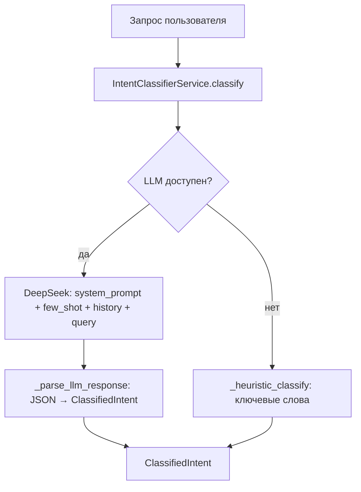
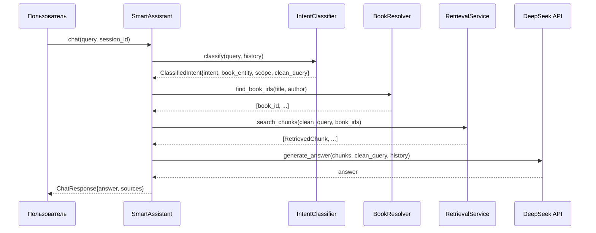
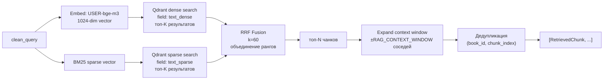
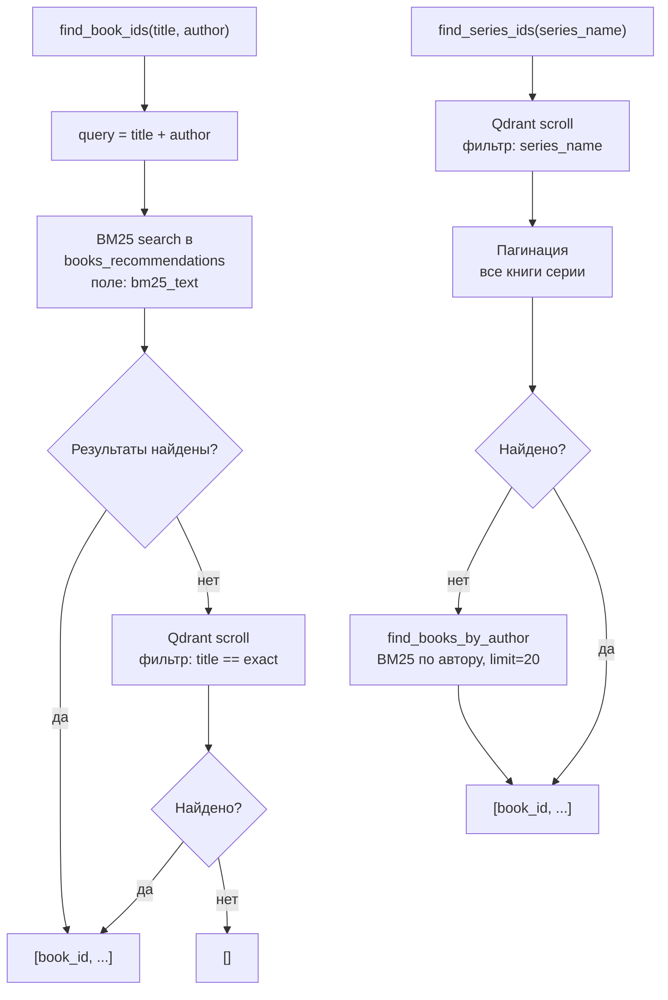
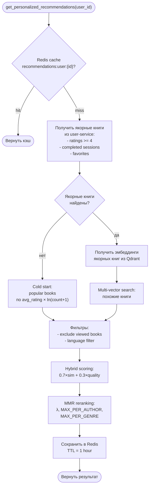
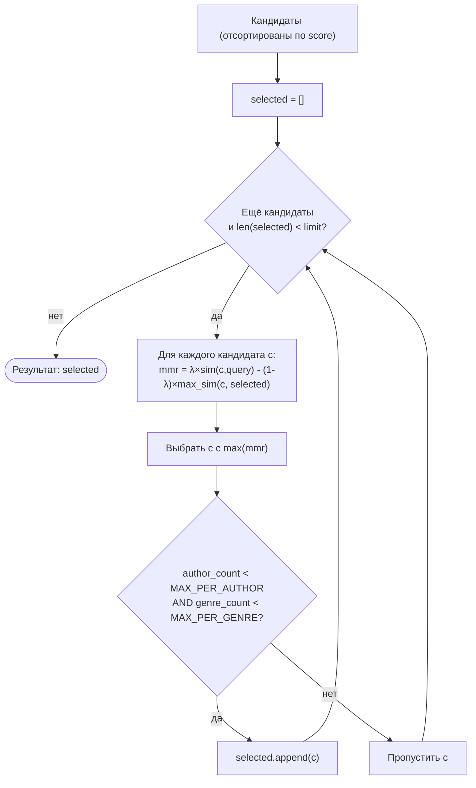
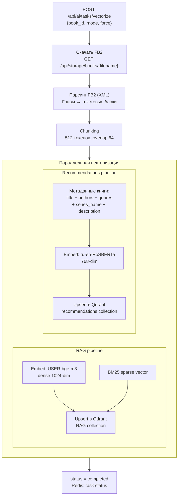

# 🧠 Алгоритмы и подходы

> [!NOTE]
> Все алгоритмы реализованы в **ai-service** (Python 3.11 / FastAPI). Остальные сервисы обращаются к нему через HTTP API.

## 💬 1. Intent Classification

Каждый запрос пользователя классифицируется за **один LLM-вызов** к DeepSeek API.

### Процесс



LLM возвращает JSON:

```json
{
  "intent": "book_question",
  "title": "Владычица озера",
  "author": "Анджей Сапковский",
  "scope": "book",
  "clean_query": "кем была Цири"
}
```

### 🏷️ Типы интентов

| Intent              | Описание                             |
| ------------------- | ------------------------------------ |
| `book_question` 🐟  | Вопрос о конкретной книге или авторе |
| `recommendation` ⭐ | Запрос на рекомендации книг          |
| `quote_search` 📝   | Поиск цитаты                         |
| `general` 🌐        | Общий вопрос по всей библиотеке      |

### 🔍 scope — область поиска

Поле `scope` определяет ширину поиска для `book_question`:

- `"book"` — пользователь назвал конкретную книгу → поиск только по ней
- `"series"` — пользователь назвал автора/серию без конкретной книги → `BookResolverService.find_series_ids()` → все книги серии

### 📞 История диалога

> [!TIP]
> История диалога хранится в Redis и автоматически подставляется в промпт — благодаря этому LLM понимает контекст уточняющих вопросов и местоимений.

Если в Redis есть история (`chat:history:{session_id}`), она добавляется в промпт перед запросом в виде блока «Предыдущий контекст диалога:». Это позволяет классификатору разрешать местоимения и уточняющие вопросы.

---

## 🔎 2. RAG Pipeline (Retrieval-Augmented Generation)

### Схема



### 🔀 Гибридный поиск (Hybrid Search)

`RetrievalService.search_chunks()` выполняет два параллельных запроса к Qdrant:



1. **Dense search** — эмбеддинг запроса через `USER-bge-m3` → поиск по `text_dense`
2. **Sparse search** — BM25-индекс → поиск по `text_sparse`

Результаты объединяются через **RRF (Reciprocal Rank Fusion)**:

$$\text{RRF}(d) = \sum_{r \in R} \frac{1}{k + r(d)}, \quad k = 60$$

где $r(d)$ — позиция документа $d$ в ранжированном списке $r$.

### 📐 Контекстное окно (Context Window)

После получения топ-N чанков сервис расширяет контекст за счёт соседних чанков:

- Для каждого найденного чанка запрашиваются ±`RAG_CONTEXT_WINDOW` чанков (по `chunk_index`)
- Дедупликация по `(book_id, chunk_index)`

### 🎯 BookResolver: поиск книги по title/author



`BookResolverService.find_book_ids(title, author)`:

1. Строит запрос: `"{title} {author}"` (или только один из них)
2. BM25-поиск в коллекции `books_recommendations` (поле `bm25_text`)
3. Fallback: Qdrant scroll с точным фильтром по полю `title`
4. Возвращает `[book_id, ...]`

Для `scope="series"`:

- `find_series_ids(series_name)` — ищет все книги с `series_name` через scroll с пагинацией
- Fallback: `find_books_by_author(author, limit=20)` — BM25 по автору

---

## ⭐ 3. Система рекомендаций

### 👤 Персональные рекомендации

`RecommendationEngine.get_personalized_recommendations(user_id)`:



### 📊 Гибридный скоринг

> [!TIP]
> `alpha=0.7` — векторное сходство весит вдвое больше, чем качество рейтинга. Логарифмическая нормализация `ratings_count` нивелирует перекос в сторону популярных книг.

`calculate_hybrid_score(vector_similarity, avg_rating, ratings_count, alpha=0.7)`:

$$\text{score} = \alpha \cdot \text{sim} + (1 - \alpha) \cdot \text{quality}$$

где:
$$\text{quality} = \frac{\text{avg\_rating}}{5} \cdot \left(0.7 + 0.3 \cdot \frac{\ln(\text{count} + 1)}{\ln(1001)}\right)$$

Логарифмическая нормализация `ratings_count` нивелирует перекос в сторону популярных книг.

### 🔥 Популярный скоринг (cold start)

`calculate_popularity_score(avg_rating, ratings_count)`:

$$\text{popularity} = \text{avg\_rating} \cdot \ln(\text{count} + 1)$$

### 🎲 MMR (Maximal Marginal Relevance)

`MMRService.apply_mmr()` перебирает кандидатов и на каждом шаге выбирает тот, у которого максимальна величина:

$$\text{MMR} = \lambda \cdot \text{Sim}(item, query) - (1 - \lambda) \cdot \max_{s \in S}[\text{Sim}(item, s)]$$



Дополнительные ограничения (из `settings`):

- `MAX_PER_AUTHOR` — не более N книг одного автора в результатах
- `MAX_PER_GENRE` — не более N книг одного жанра

---

## 🗄️ 4. Векторизация книг (Indexing)

> [!NOTE]
> Векторизация одновременно индексирует книгу в две Qdrant-коллекции: чанки для RAG и мета-эмбеддинги для рекомендаций — разные модели и цели.

Процесс индексации FB2-файла в Qdrant:



Статус задачи отслеживается через `GET /api/ai/tasks/vectorize/status/{book_id}`.
</content>
</invoke>
