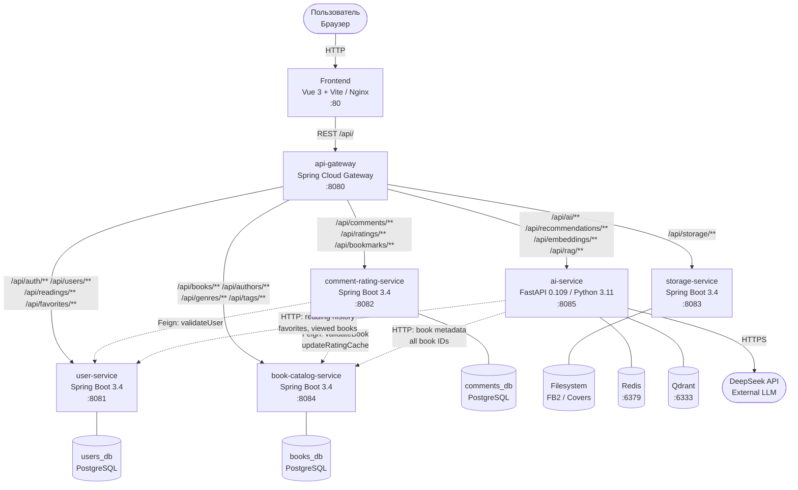
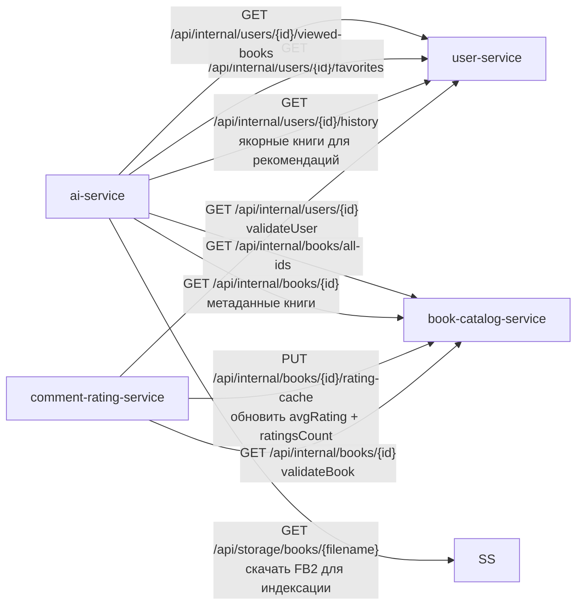
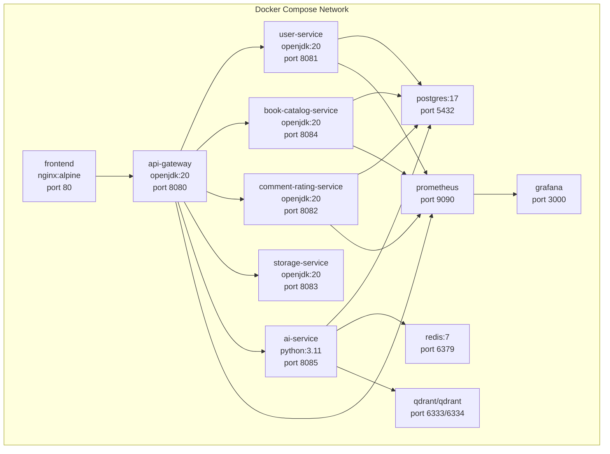

# 🏗️ Архитектура системы

## 🌐 Общий обзор

Digital Library — микросервисное приложение с единственной точкой входа через API Gateway.

> [!NOTE]
> Все клиентские запросы проходят через **api-gateway** — единственный публичный сервис в сети. Внутренние сервисы недоступны напрямую из браузера.

### 🗺️ Системный обзор

### 🔗 Межсервисные Feign-вызовы

### 🐳 Деплоймент (Docker Compose)

## 🧩 Компоненты

### 🚪 api-gateway (Spring Cloud Gateway 2024.0.0)

Единственная точка входа. Выполняет:

- Маршрутизацию по Path predicate
- JWT-аутентификацию (`JwtAuthenticationFilter`)
- CORS (разрешены `http://localhost:*` и `http://127.0.0.1:*`)
- Circuit Breaker (Resilience4j)

| Маршрут                | Path                                                                                       |
| ---------------------- | ------------------------------------------------------------------------------------------ |
| user-service           | `/api/users/**`, `/api/auth/**`, `/api/readings/**`, `/api/favorites/**`                   |
| book-catalog-service   | `/api/books/**`, `/api/authors/**`, `/api/genres/**`, `/api/tags/**`, `/api/statistics/**` |
| comment-rating-service | `/api/comments/**`, `/api/ratings/**`, `/api/bookmarks/**`                                 |
| storage-service        | `/api/storage/**`                                                                          |
| ai-service             | `/api/recommendations/**`, `/api/embeddings/**`, `/api/ai/**`                              |

### 👤 user-service (Spring Boot 3.4, Java 20)

Авторизация, профили, история чтения. Собственная база PostgreSQL `users_db`.

### 📚 book-catalog-service (Spring Boot 3.4, Java 20)

Каталог книг, авторов, жанров, тегов. Хранит денормализованный рейтинг (обновляется через Feign из comment-rating-service). База `books_db`.

### 💬 comment-rating-service (Spring Boot 3.4, Java 20)

Отзывы, оценки (1–5), закладки. Перед сохранением валидирует user и book через OpenFeign. База `comments_db`.

### 🗂️ storage-service (Spring Boot 3.4, Java 20)

Хранение файлов (FB2, обложки) на диске. Нет собственной БД.

### 🤖 ai-service (Python 3.11, FastAPI 0.109)

RAG, персональные рекомендации, векторизация. Работает с Qdrant (векторный поиск) и Redis (кэш, история диалогов).

## 📋 Принятые архитектурные решения

> [!TIP]
> ADR (Architecture Decision Record) — короткие записи о том, **почему** было принято то или иное решение, а не только **что** было сделано.

### ADR-001: Single Database per Service

Каждый Java-сервис имеет собственную PostgreSQL базу (`users_db`, `books_db`, `comments_db`).

Причина: изоляция данных, независимое масштабирование и развёртывание, отсутствие cross-service JOIN.

Компромисс: межсервисная валидация через OpenFeign вместо FK-ограничений.

### ADR-002: API Gateway как единственная точка входа

Frontend общается только с api-gateway. Внутренние сервисы не доступны напрямую из сети.

Причина: единое место для JWT-проверки, CORS, Circuit Breaker.

### ADR-003: Денормализованный рейтинг в book-catalog

Поля `average_rating` и `ratings_count` хранятся в таблице `books` и обновляются через Feign-вызов из comment-rating-service при каждом новом рейтинге.

Причина: исключить cross-service запрос при каждой загрузке каталога.

### ADR-004: ai-service на Python (не Java)

Причина: экосистема ML/NLP (sentence-transformers, PyTorch, Qdrant Python SDK) значительно богаче в Python. Интеграция через HTTP API.

### ADR-005: HttpOnly Cookie для JWT 🔐

JWT не хранится в localStorage, а устанавливается как `HttpOnly; SameSite=Strict; Secure` через api-gateway.

Причина: защита от XSS-атак.

### ADR-006: Мягкое удаление (Soft Delete) для комментариев

Поле `deleted = true` вместо физического DELETE.

Причина: сохранение контекста в ветках обсуждений.

## 📐 Диаграмма архитектуры

> draw.io-диаграмма находится в [`docs/architecture.drawio`](../docs/architecture.drawio) (откроется в draw.io или VS Code с плагином).

## 📊 Мониторинг

Prometheus scrape + Grafana дашборды (конфигурация в `old_docker/prometheus/` и `old_docker/grafana/`).

| Метрика                   | Источник                        |
| ------------------------- | ------------------------------- |
| HTTP request rate/latency | Actuator `/actuator/prometheus` |
| JVM memory/GC             | Spring Boot Actuator            |
| Circuit Breaker state     | Resilience4j metrics            |
