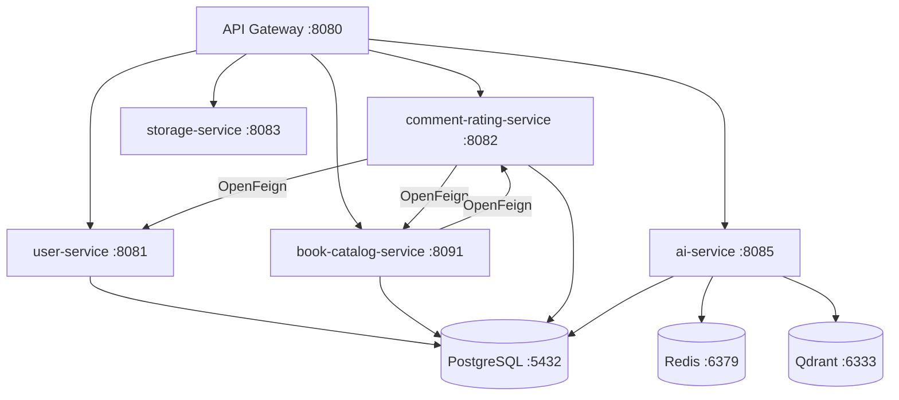
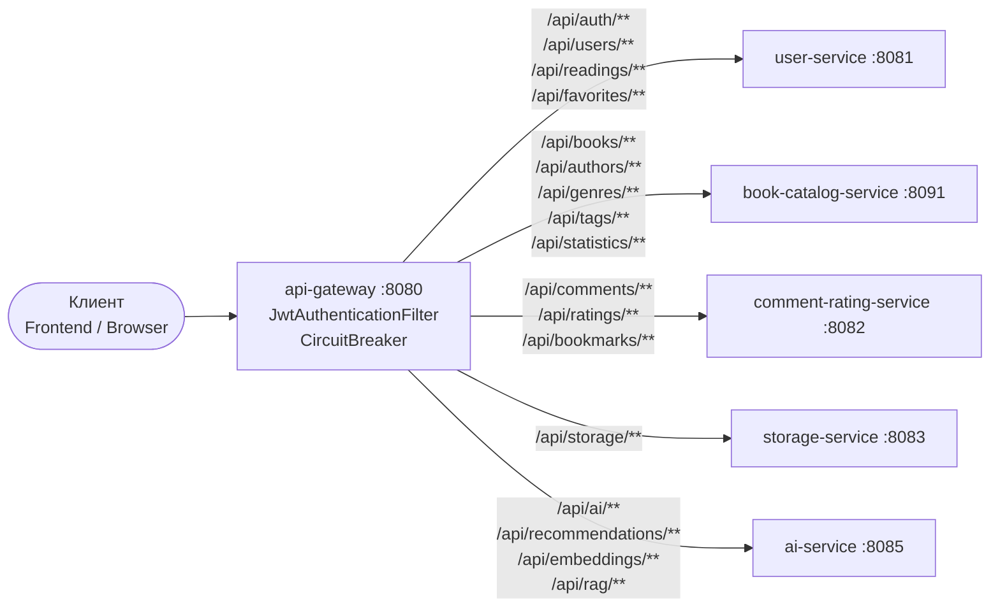
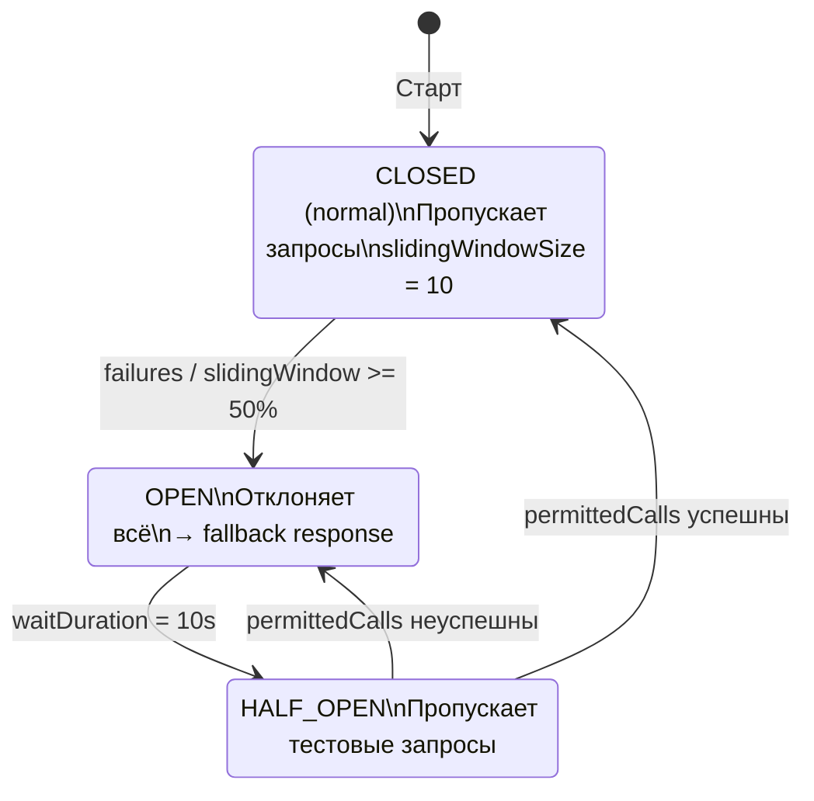
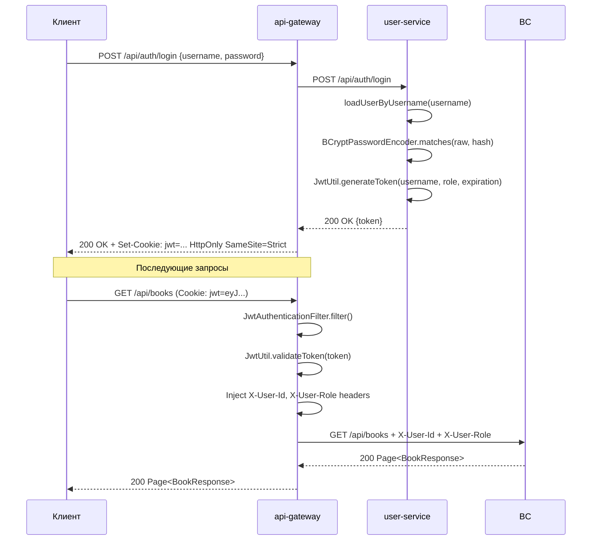
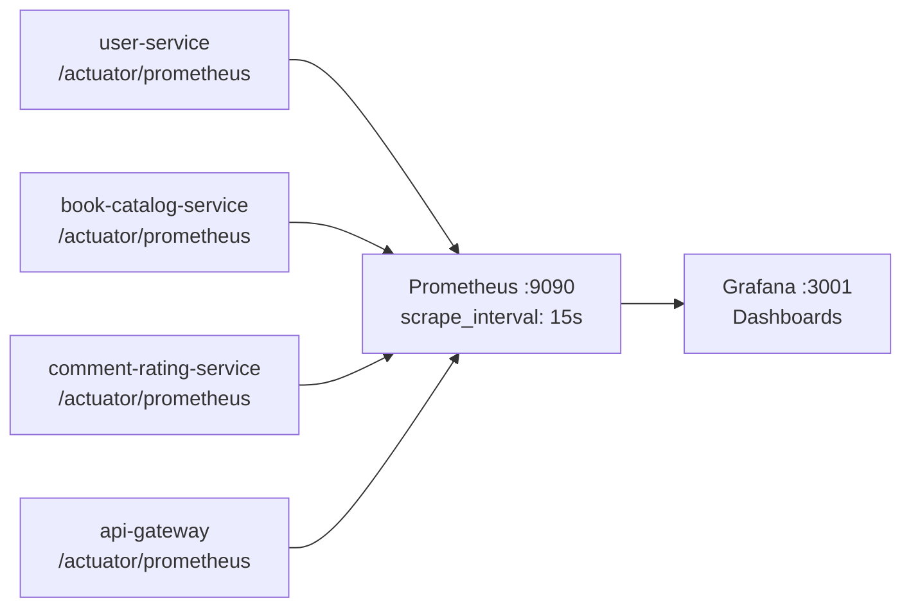

# ⚙️ Backend

Бэкенд Digital Library состоит из 5 Java-сервисов на Spring Boot 3 и одного Python-сервиса на FastAPI. Все сервисы изолированы и взаимодействуют через REST. Единая точка входа — API Gateway.

## 🖧 Архитектура взаимодействия

Межсервисное взаимодействие в Java-сервисах реализовано через **Spring Cloud OpenFeign** (сгенерированные клиенты из OpenAPI-спецификаций). Ai-service общается с Java-сервисами через `aiohttp`.

## 📦 Сервисы

| Сервис                    | Порт | Назначение                                       | Подробнее                                                                |
| ------------------------- | ---- | ------------------------------------------------ | ------------------------------------------------------------------------ |
| 🚪 api-gateway            | 8080 | Маршрутизация, CORS, Circuit Breaker             | [services/api-gateway.md](services/api-gateway.md)                       |
| 👤 user-service           | 8081 | Аутентификация, JWT, профили, история, избранное | [services/user-service.md](services/user-service.md)                     |
| 💬 comment-rating-service | 8082 | Комментарии, рейтинги, закладки                  | [services/comment-rating-service.md](services/comment-rating-service.md) |
| 🗂️ storage-service        | 8083 | Хранение и раздача FB2-файлов и обложек          | [services/storage-service.md](services/storage-service.md)               |
| 📚 book-catalog-service   | 8091 | Каталог книг, авторы, жанры, поиск               | [services/book-catalog-service.md](services/book-catalog-service.md)     |
| 🤖 ai-service             | 8085 | RAG-чат, рекомендации, векторизация              | [services/ai-service.md](services/ai-service.md)                         |

## 🧩 Общие компоненты

> [!NOTE]
> Модуль `shared/common-models` — общая Maven-зависимость, подключаемая по сервисам. Позволяет избежать дублирования JWT-логики и классов исключений.

Модуль `shared/common-models` содержит классы, используемые несколькими сервисами:

- `JwtUtil` — генерация и верификация JWT (HS256, JJWT)
- `ResourceNotFoundException` — 404-ответ во всех сервисах
- `BadRequestException` — 400-ответ

Каждый сервис подключает `common-models` как локальную Maven-зависимость.

## 🛑 Маршруты API Gateway

### 📄 Схема маршрутизации

### 🔄 Circuit Breaker — состояния

> [!IMPORTANT]
> `slidingWindowSize=10`, `failureRateThreshold=50%`, `waitDurationInOpenState=10s`

Таблица маршрутов настроена в `application.properties` через `spring.cloud.gateway.routes`:

| Маршрут                                                                                    | Upstream               |
| ------------------------------------------------------------------------------------------ | ---------------------- |
| `/api/users/**`, `/api/auth/**`, `/api/readings/**`, `/api/favorites/**`                   | user-service           |
| `/api/books/**`, `/api/authors/**`, `/api/genres/**`, `/api/tags/**`, `/api/statistics/**` | book-catalog-service   |
| `/api/comments/**`, `/api/ratings/**`, `/api/bookmarks/**`                                 | comment-rating-service |
| `/api/storage/**`                                                                          | storage-service        |
| `/api/recommendations/**`, `/api/embeddings/**`, `/api/ai/**`                              | ai-service             |

## Circuit Breaker

API Gateway использует Resilience4j с параметрами из `application.properties`:

- `slidingWindowSize=10` — размер окна для подсчёта отказов
- `failureRateThreshold=50` — порог открытия цепи (50% отказов)
- `waitDurationInOpenState=10s` — время ожидания перед полуоткрытым состоянием

## 🔑 JWT — поток аутентификации

## 📊 Мониторинг

Каждый Java-сервис имеет `/actuator/health` и подключён к Prometheus через `spring-boot-starter-actuator`. Grafana-дашборды доступны на порту 3001.

## 📖 API Reference

- [user-service API](api/user-service-api.md)
- [book-catalog-service API](api/book-catalog-api.md)
- [comment-rating-service API](api/comment-rating-api.md)
- [storage-service API](api/storage-api.md)
- [ai-service API](api/ai-service-api.md)
