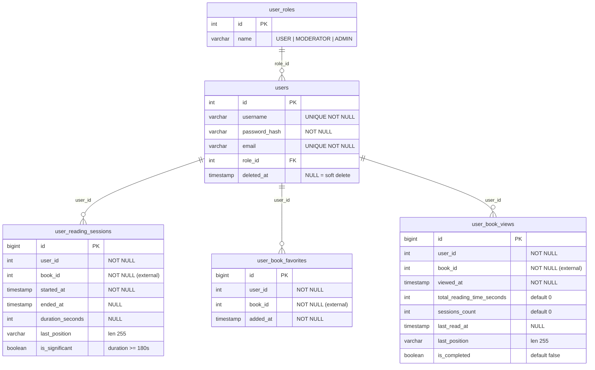
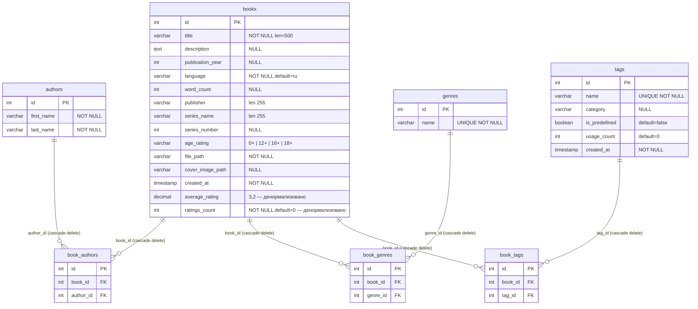
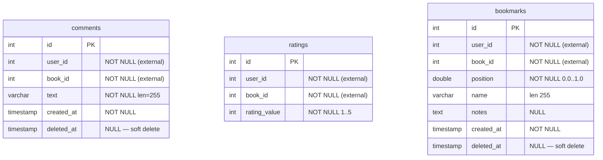
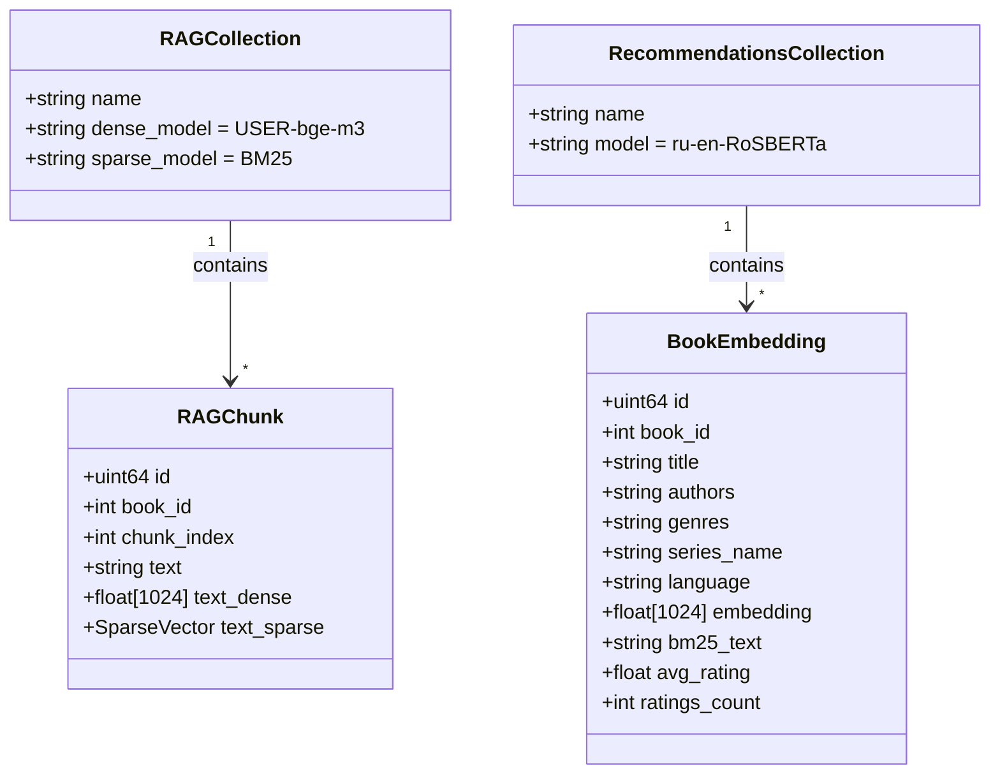
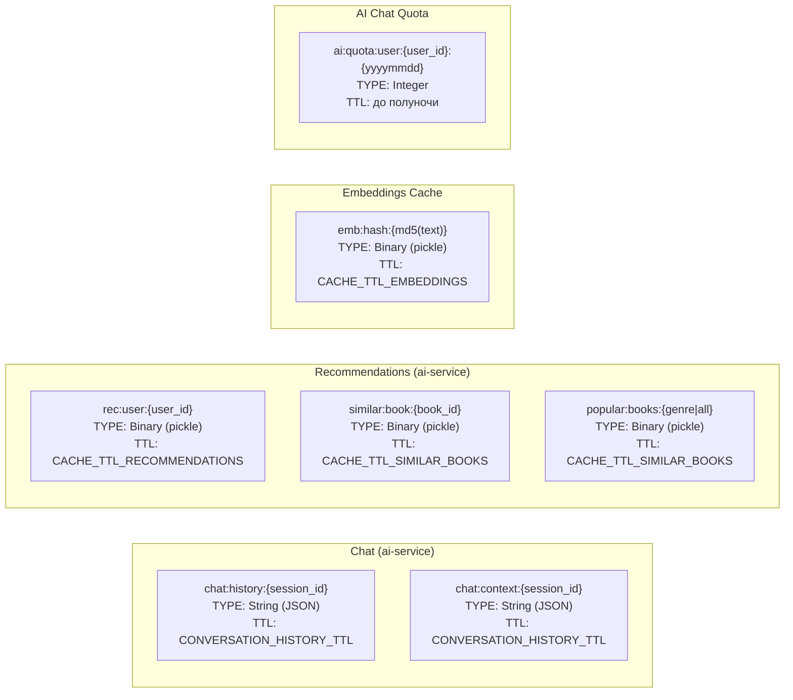

# 🗄️ База данных

> [!NOTE]
> Каждый Java-сервис использует **собственную** PostgreSQL-БД. Сервисы не имеют прямых FK-ссылок друг на друга — межсервисная целостность обеспечивается Feign-валидацией при записи.

## 📊 Диаграммы ER

### 👤 `users_db`

### 📚 `books_db`

### 💬 `comments_ratings_db`

> [!IMPORTANT]
> Связей между таблицами нет — `user_id` и `book_id` являются внешними ключами, живущими в других сервисах. Целостность обеспечивается Feign-валидацией при записи.

### 🔍 Qdrant — векторные коллекции

### ⚡ Redis — структура ключей

---

## 👤 `users_db` — user-service

### `user_roles`

| Колонка | Тип     | Ограничения                                      |
| ------- | ------- | ------------------------------------------------ |
| id      | integer | PK                                               |
| name    | varchar | NOT NULL, UNIQUE (`USER`, `MODERATOR`, `ADMIN`)  |

### `users`

| Колонка       | Тип       | Ограничения                   |
| ------------- | --------- | ----------------------------- |
| id            | integer   | PK, IDENTITY                  |
| username      | varchar   | NOT NULL, UNIQUE              |
| password_hash | varchar   | NOT NULL                      |
| email         | varchar   | NOT NULL, UNIQUE              |
| role_id       | integer   | FK → user_roles(id), NOT NULL |
| deleted_at    | timestamp | NULL (soft delete)            |

**Индексы:** `idx_user_deleted_at`, `idx_user_role_id`

### `user_reading_sessions`

Сессии чтения конкретной книги.

| Колонка          | Тип          | Ограничения                                |
| ---------------- | ------------ | ------------------------------------------ |
| id               | bigint       | PK                                         |
| user_id          | integer      | NOT NULL                                   |
| book_id          | integer      | NOT NULL                                   |
| started_at       | timestamp    | NOT NULL                                   |
| ended_at         | timestamp    | NULL                                       |
| duration_seconds | integer      | NULL                                       |
| last_position    | varchar(255) | NULL                                       |
| is_significant   | boolean      | default false (true если duration ≥ 180 с) |

**Индексы:** `idx_sessions_user_id`, `idx_sessions_book_id`, `idx_sessions_user_book`, `idx_sessions_started`

### `user_book_favorites`

| Колонка  | Тип       | Ограничения |
| -------- | --------- | ----------- |
| id       | bigint    | PK          |
| user_id  | integer   | NOT NULL    |
| book_id  | integer   | NOT NULL    |
| added_at | timestamp | NOT NULL    |

**Constraints:** `uk_favorites_user_book (user_id, book_id)`

### `user_book_views`

Агрегат статистики просмотров книги. Одна запись на пару (user, book).

| Колонка                    | Тип          | Ограничения   |
| -------------------------- | ------------ | ------------- |
| id                         | bigint       | PK            |
| user_id                    | integer      | NOT NULL      |
| book_id                    | integer      | NOT NULL      |
| viewed_at                  | timestamp    | NOT NULL      |
| total_reading_time_seconds | integer      | default 0     |
| sessions_count             | integer      | default 0     |
| last_read_at               | timestamp    | NULL          |
| last_position              | varchar(255) | NULL          |
| is_completed               | boolean      | default false |

**Constraints:** `uk_views_user_book (user_id, book_id)`

---

## 📚 `books_db` — book-catalog-service

### `books`

| Колонка          | Тип          | Ограничения                           |
| ---------------- | ------------ | ------------------------------------- |
| id               | integer      | PK                                    |
| title            | varchar(500) | NOT NULL                              |
| description      | text         | NULL                                  |
| publication_year | integer      | NULL                                  |
| language         | varchar(10)  | NOT NULL, default 'ru'                |
| word_count       | integer      | NULL                                  |
| publisher        | varchar(255) | NULL                                  |
| series_name      | varchar(255) | NULL                                  |
| series_number    | integer      | NULL                                  |
| age_rating       | varchar(5)   | NULL (`0+`, `12+`, `16+`, `18+`)      |
| file_path        | varchar      | NOT NULL                              |
| cover_image_path | varchar      | NULL                                  |
| created_at       | timestamp    | NOT NULL                              |
| average_rating   | decimal(3,2) | default 0.00 (денормализовано)        |
| ratings_count    | integer      | NOT NULL, default 0 (денормализовано) |

**Индексы:** `idx_book_title`, `idx_book_pub_year`, `idx_book_language`, `idx_book_created`

> [!TIP]
> `average_rating` и `ratings_count` обновляются через Feign из comment-rating-service при каждом новом рейтинге.

### `authors`

| Колонка    | Тип          | Ограничения |
| ---------- | ------------ | ----------- |
| id         | integer      | PK          |
| first_name | varchar(255) | NOT NULL    |
| last_name  | varchar(255) | NOT NULL    |

### `genres`

| Колонка | Тип          | Ограничения        |
| ------- | ------------ | ------------------ |
| id      | integer      | PK                 |
| name    | varchar(255) | NOT NULL, UNIQUE   |

### `tags`

| Колонка      | Тип          | Ограничения                           |
| ------------ | ------------ | ------------------------------------- |
| id           | integer      | PK                                    |
| name         | varchar(50)  | NOT NULL, UNIQUE                      |
| category     | varchar(50)  | NULL                                  |
| is_predefined| boolean      | DEFAULT false                         |
| usage_count  | integer      | DEFAULT 0                             |
| created_at   | timestamp    | NOT NULL, DEFAULT CURRENT_TIMESTAMP   |

### Связующие таблицы

| Таблица      | Поля                          | Ограничения                                             |
| ------------ | ----------------------------- | ------------------------------------------------------- |
| book_authors | id, book_id, author_id        | FK → books(id), authors(id), ON DELETE CASCADE          |
| book_genres  | id, book_id, genre_id         | FK → books(id), genres(id), ON DELETE CASCADE           |
| book_tags    | id, book_id, tag_id           | FK → books(id), tags(id), ON DELETE CASCADE, UNIQUE(book_id, tag_id) |

---

## 💬 `comments_ratings_db` — comment-rating-service

### `comments`

| Колонка    | Тип       | Ограничения        |
| ---------- | --------- | ------------------ |
| id         | integer   | PK                 |
| user_id    | integer   | NOT NULL           |
| book_id    | integer   | NOT NULL           |
| text       | text      | NOT NULL           |
| created_at | timestamp | NOT NULL           |
| deleted_at | timestamp | NULL (soft delete) |

**Индексы:** `idx_comment_book_id`, `idx_comment_user_id`, `idx_comment_created_at`, `idx_comment_deleted_at`

### `ratings`

| Колонка      | Тип     | Ограничения                 |
| ------------ | ------- | --------------------------- |
| id           | integer | PK                          |
| rating_value | integer | NOT NULL, 1–5               |
| user_id      | integer | NOT NULL                    |
| book_id      | integer | NOT NULL                    |

**Constraints:** `uk_rating_user_book (user_id, book_id)` — один рейтинг на пользователя

### `bookmarks`

| Колонка    | Тип          | Ограничения                        |
| ---------- | ------------ | ---------------------------------- |
| id         | integer      | PK                                 |
| user_id    | integer      | NOT NULL                           |
| book_id    | integer      | NOT NULL                           |
| position   | double       | NOT NULL (позиция в книге 0.0–1.0) |
| name       | varchar(255) | NULL                               |
| notes      | text         | NULL                               |
| created_at | timestamp    | NOT NULL                           |
| deleted_at | timestamp    | NULL (soft delete)                 |

---

## 🔍 Qdrant-коллекции — ai-service

Qdrant не является реляционной БД, но содержит два основным namespace:

| Коллекция                         | Модель                              | Назначение                              |
| --------------------------------- | ----------------------------------- | --------------------------------------- |
| RAG-коллекция (чанки)             | USER-bge-m3 (dense) + BM25 (sparse) | Текстовые чанки книг для RAG            |
| recommendations-коллекция (книги) | ru-en-RoSBERTa                      | Мета-эмбеддинги книг для поиска похожих |

Поля точки в RAG-коллекции: `book_id`, `chunk_index`, `text`, `text_dense` (vector), `text_sparse` (sparse vector).

## ⚡ Redis — ai-service

| Ключ                                | Тип    | TTL           | Содержимое               |
| ----------------------------------- | ------ | ------------- | ------------------------ |
| `chat:history:{session_id}`         | List   | настраивается | История сообщений        |
| `chat:context:{session_id}`         | String | настраивается | Активный контекст книги  |
| `recommendations:user:{user_id}`    | String | 1 час         | JSON массив рекомендаций |
| `recommendations:similar:{book_id}` | String | настраивается | Похожие книги            |
