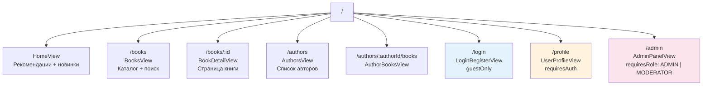
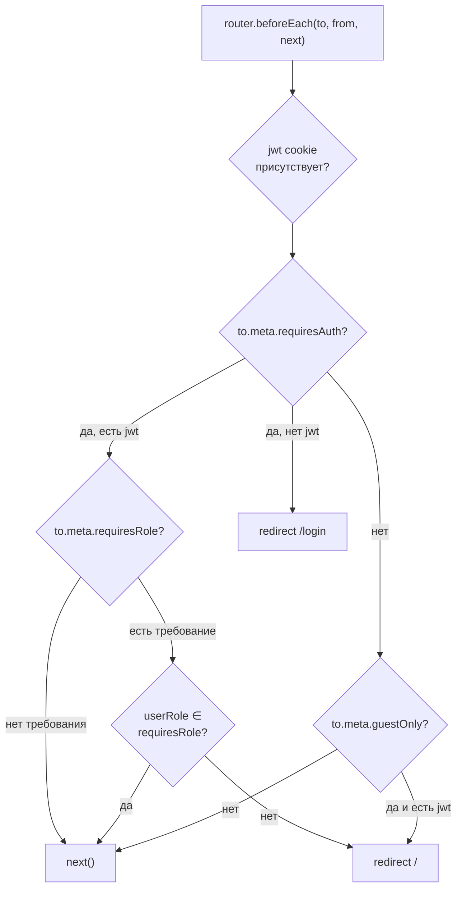
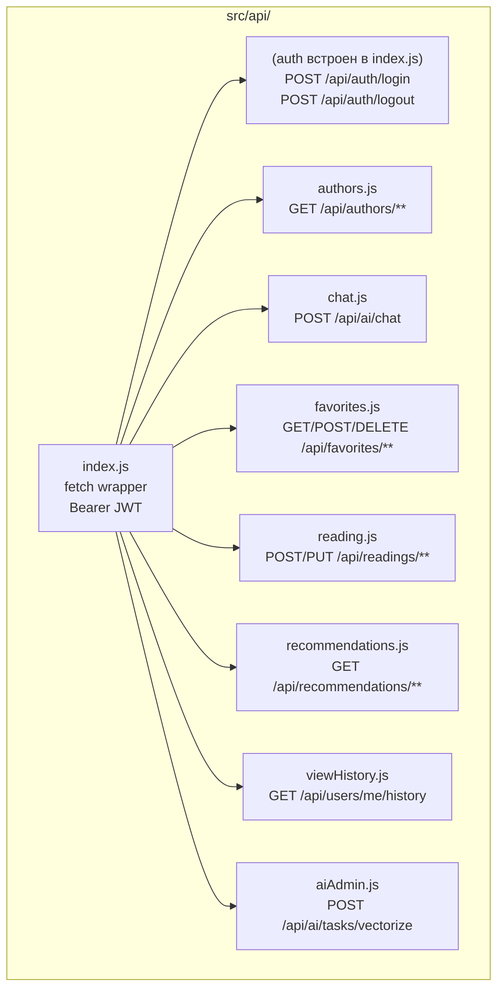
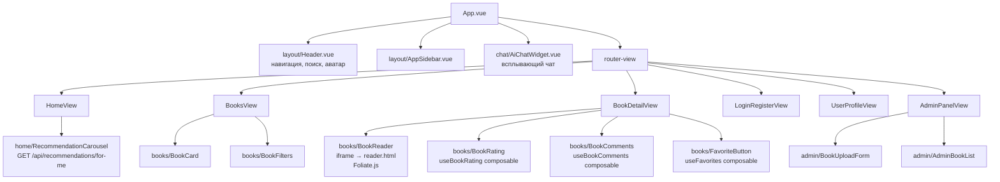

# 🎨 Frontend

Фронтенд — Single Page Application на Vue 3 + Vite 7, раздаётся через Nginx.

## 🛠️ Технологии

| Библиотека       | Версия | Назначение                |
| ---------------- | ------ | ------------------------- |
| 💭 Vue 3         | 3.x    | Реактивный UI framework   |
| ⚡ Vite          | 7.x    | Сборщик, dev server       |
| 🛣️ Vue Router 4  | 4.x    | Клиентская маршрутизация  |
| 📡 Axios / Fetch | —      | HTTP-запросы              |
| 📖 Foliate.js    | —      | Встроенный ридер FB2/EPUB |

## 📁 Структура проекта

```
src/
├── main.js               # Инициализация Vue-приложения
├── App.vue               # Корневой компонент, layout-обёртка
├── router/
│   └── index.js          # Маршруты, navigation guards
├── api/
│   ├── index.js          # Базовый fetch-клиент (Bearer JWT из cookie)
│   ├── authors.js
│   ├── chat.js           # POST /api/ai/chat
│   ├── favorites.js
│   ├── reading.js
│   ├── recommendations.js
│   ├── viewHistory.js
│   └── aiAdmin.js        # Задачи векторизации
├── views/
│   ├── HomeView.vue       # Главная: рекомендации + новинки
│   ├── BooksView.vue      # Каталог с поиском и фильтрами
│   ├── BookDetailView.vue # Страница книги: ридер, оценки, комментарии
│   ├── AuthorsView.vue    # Список авторов
│   ├── AuthorBooksView.vue# Книги выбранного автора
│   ├── LoginRegisterView.vue # Вход / Регистрация (вкладки)
│   ├── UserProfileView.vue   # Профиль: история, избранное, закладки
│   └── AdminPanelView.vue    # Управление книгами (ROLE_ADMIN, ROLE_MODERATOR)
├── components/
│   ├── layout/
│   │   ├── Header.vue    # Навигация, поиск, аватар
│   │   └── AppSidebar.vue
│   ├── chat/
│   │   └── AiChatWidget.vue  # Всплывающий чат-виджет
│   ├── books/            # BookCard, BookFilters, BookReader,...
│   ├── home/             # RecommendationCarousel,...
│   ├── authors/
│   ├── admin/
│   ├── ui/               # Переиспользуемые UI-примитивы
│   └── icons/
└── composables/
    ├── useUser.js
    ├── useAuthors.js
    ├── useBookComments.js
    ├── useBookCover.js
    ├── useBookRating.js
    ├── useExtendedSearch.js
    ├── useFavorites.js
    ├── useReadingSession.js
    ├── useRecommendations.js
    ├── useViewHistory.js
    └── useAdminAuth.js
```

## 🛣️ Маршруты

### 🌳 Дерево маршрутизации



### 🛡️ Navigation Guard



### 📋 Таблица маршрутов

| Путь                       | Компонент         | Auth required                          |
| -------------------------- | ----------------- | -------------------------------------- |
| `/`                        | HomeView          | Нет                                    |
| `/books`                   | BooksView         | Нет                                    |
| `/books/:id`               | BookDetailView    | Нет                                    |
| `/authors`                 | AuthorsView       | Нет                                    |
| `/authors/:authorId/books` | AuthorBooksView   | Нет                                    |
| `/login`                   | LoginRegisterView | Нет (только гости)                     |
| `/profile`                 | UserProfileView   | Да                                     |
| `/admin`                   | AdminPanelView    | Да (`ROLE_ADMIN` или `ROLE_MODERATOR`) |

Navigation guard в `router/index.js` читает куку `jwt` и перенаправляет:

- неавторизованных → `/login` если `requiresAuth`
- авторизованных → `/` если `guestOnly`

## 📡 API-клиент

`src/api/index.js` реализует базовый `fetch`-клиент. JWT читается из куки через `getCookie("jwt")` и передаётся в заголовке `Authorization: Bearer <token>`. Все запросы идут на `/api` (проксируется через Nginx → api-gateway:8080).

### 📦 Структура API-модулей



### 🏛️ Иерархия компонентов (основные страницы)



```js
// Пример использования
import { api } from "@/api/index.js";
const books = await api.get("/books?page=0&size=20");
await api.post("/ratings", { bookId: 42, rating: 5 });
```

## 🤖 AI Chat Widget

> [!TIP]
> `session_id` генерируется один раз и сохраняется в `localStorage`. История диалога хранится на сервере в Redis — не теряется при перезагрузке страницы.

`AiChatWidget.vue` — всплывающий виджет (кнопка в углу страницы). Работает на всех страницах.

- `session_id` генерируется один раз и сохраняется в `localStorage`
- История диалога хранится на сервере в Redis (`chat:history:{session_id}`)
- Каждое сообщение: `POST /api/ai/chat { message, session_id }`
- Ответ содержит поле `sources` — список текстовых фрагментов из книг (ссылки-источники)

## 📖 Встроенный ридер

`/reader.html` (статический файл в `public/`) загружает Foliate.js и принимает параметр `?bookUrl=...` для чтения FB2/EPUB прямо в браузере.

Текущая позиция отправляется через `useReadingSession` composable: `PUT /api/readings/session/update`.

## 🚀 Сборка и запуск

```bash
# Dev-сервер
cd digital-library-frontend
npm install
npm run dev        # http://localhost:5173

# Production build
npm run build      # dist/
```

В Docker книги раздаются через Nginx (конфиг: `digital-library-frontend/nginx.conf`). Nginx проксирует `/api/*` → `api-gateway:8080`.
