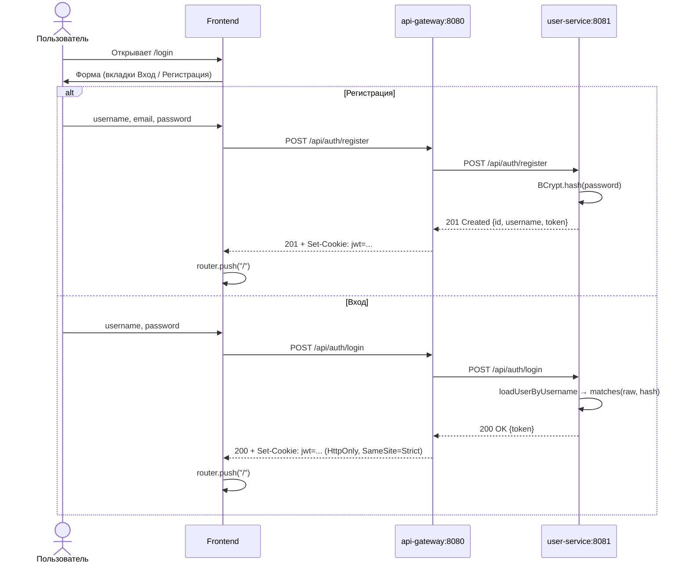
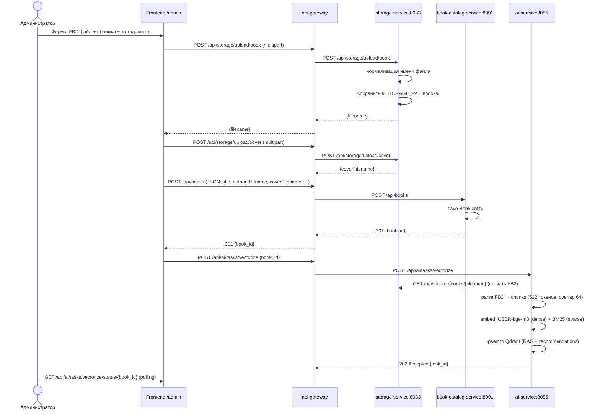
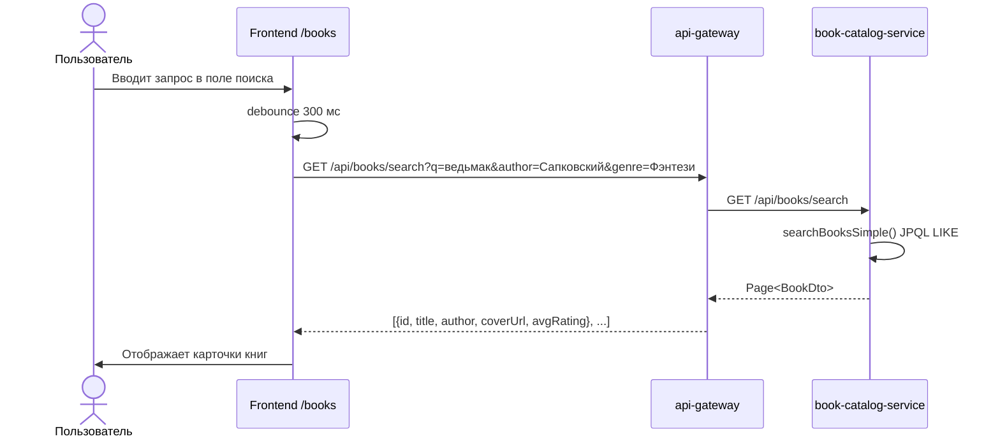
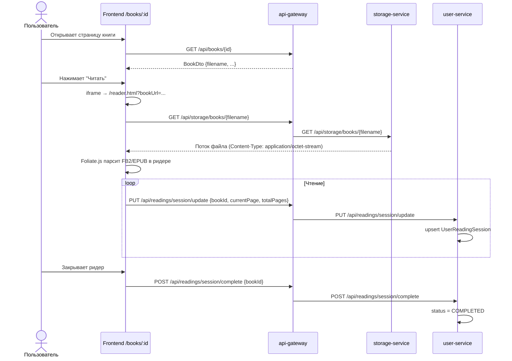
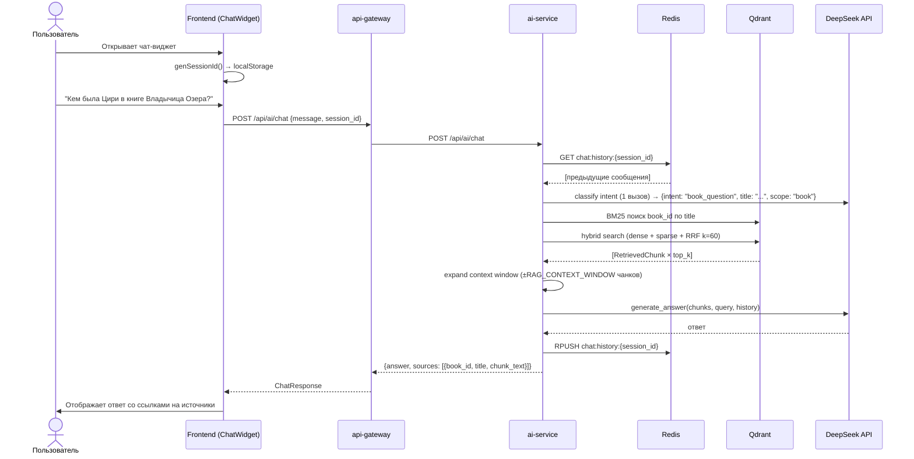
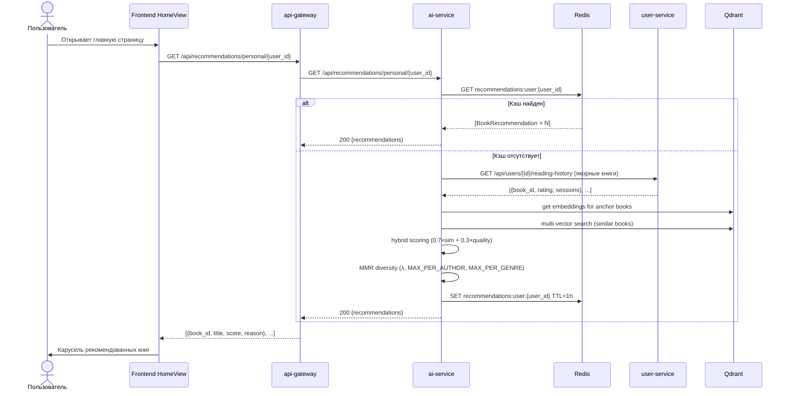
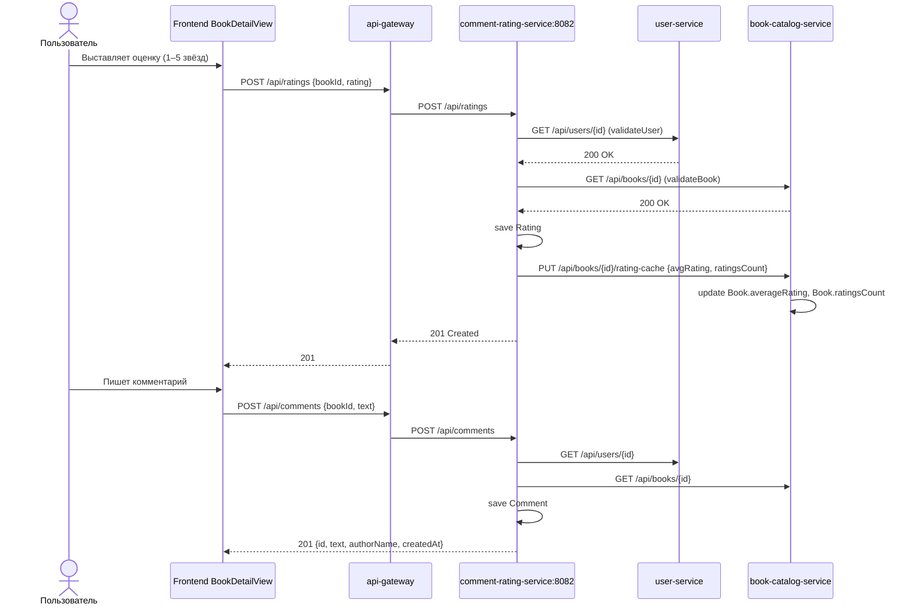

# 📘 Варианты использования

Основные сценарии взаимодействия пользователя с системой.

## 🔐 UC-1. Регистрация и вход

> [!NOTE]
> JWT сохраняется в HttpOnly-куке. Все последующие запросы через api-gateway автоматически проверяются через `JwtAuthenticationFilter`.

---

## 📤 UC-2. Загрузка книги (администратор)

---

## 🔍 UC-3. Поиск книги в каталоге

---

## 📖 UC-4. Чтение книги во встроенном ридере

---

## 🤖 UC-5. AI-чат с ассистентом

---

## ⭐ UC-6. Персональные рекомендации

---

## ⭐ UC-7. Оценка и комментирование книги

