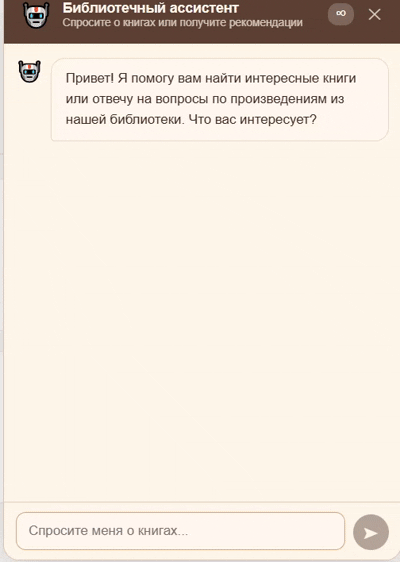
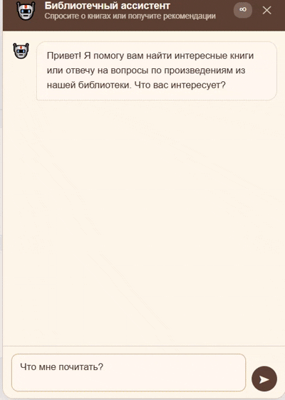

# ai-service

Предоставляет AI-функциональность: RAG-чат по книгам, система рекомендаций, векторизация текстов.

**Порт:** 8085  
**Swagger UI:** http://localhost:8085/docs

## Технологии

- Python 3.11, FastAPI 0.109, Uvicorn
- **Qdrant** — векторная БД (коллекции: `books_recommendations`, RAG-коллекция чанков)
- **Redis** — кэш рекомендаций, история диалогов (`chat:history:{session_id}`, TTL 1 час)
- **sentence-transformers** — две модели:
  - `ru-en-RoSBERTa` — для рекомендаций (загружается при старте)
  - `USER-bge-m3` — для RAG dense vectors (загружается лениво при первом запросе)
- **DeepSeek API** — LLM для классификации интентов и генерации ответов
- `aiohttp` — HTTP-клиент для обращения к Java-сервисам
- `loguru` — структурированное логирование

## Архитектура сервисов

```
SmartAssistantService (оркестратор чата)
├── IntentClassifierService  — 1 LLM-вызов → тип запроса + структурированные данные
├── BookResolverService      — title/author → [book_id] через Qdrant BM25
├── RAGService               — hybrid search + LLM-ответ
│   └── RetrievalService     — Dense (USER-bge-m3) + Sparse (BM25) + RRF fusion
│       └── RerankerService  — BAAI/bge-reranker-v2-m3 (опционально)
├── NLRecommendationService  — обработка рекомендательных запросов
│   └── RecommendationEngine — персональные/похожие/популярные рекомендации
│       └── MMRService       — Maximal Marginal Relevance для разнообразия
└── ConversationHistoryService — история диалога в Redis
```

## 🎥 Демонстрация AI-ассистента

В этом репозитории для демонстрации используются **2 гифки**.

- **Гиф 1 — RAG/Q&A по книге + контекст + (пока неидеальные) цитаты**  
  Файл: `docs/demo/ai-assistant-rag-master-margarita.gif`  
  
  
  
  Что происходит в сервисе:
  - `IntentClassifierService` определяет интент (`book_question` / `quote_search`) и извлекает из запроса **название/автора** (если они указаны).
  - `BookResolverService` подбирает `book_id`, затем `RetrievalService` делает **гибридный поиск** по чанкам в Qdrant (`books_rag_chunks`), после чего `RAGService` формирует ответ со ссылками на найденные фрагменты.
  - Вопросы “в продолжение” используют `ConversationHistoryService` и Redis (`chat:history:{session_id}`, `chat:context:{session_id}`), поэтому контекст сохраняется.
  - Режим “точных цитат” (`quote_search`) сейчас может работать **не идеально** — качество зависит от того, какие фрагменты попали в retrieval.
  Примеры вопросов из гифки:
  - _«Кто такой Воланд и как он представлен в романе?»_
  - _«Что произошло на сеансе в Варьете?»_
  - _«Как связаны Мастер и Понтий Пилат в структуре книги?»_
  - _«Найди цитаты Мастера про творчество!»_

- **Гиф 2 — рекомендации “что почитать” + уточнение предпочтений**  
  Файл: `docs/demo/ai-assistant-recommendations.gif`  
  
  
  
  Что происходит в сервисе:
  - `RecommendationEngine` строит персональные рекомендации на основе данных из user-service (**избранное / прочитано / оценено**) + эмбеддингов Qdrant (`books_recommendations`) + скоринга `calculate_hybrid_score`.
  - `NLRecommendationService` обрабатывает уточняющие запросы (жанр/настроение/ограничения) и вызывает `RecommendationEngine`.
  Примеры запросов из гифки:
  - _«Что почитать?»_ → подбор под твои предпочтения.
  - _«Что почитать из фантастики перед сном?»_ → фантастика + “лёгкое” + не очень длинные книги.
  - _«Произведения Ремарка про любовь»_ → рекомендации по автору/тематике (через метаданные).

---

## Компоненты RAG

### IntentClassifierService

Один LLM-вызов (DeepSeek) → JSON с полями `intent`, `title`, `author`, `scope`, `clean_query`, фильтры.

Типы интентов: `book_question`, `recommendation`, `quote_search`, `general`.

`scope` — область поиска: `"book"` (конкретная книга) vs `"series"` (вся серия/автор целиком).

При недоступности LLM — эвристический fallback по ключевым словам.

### RetrievalService

Гибридный поиск по чанкам книг в Qdrant:

- Dense vectors: `USER-bge-m3` → поле `text_dense`
- Sparse vectors: BM25 → поле `text_sparse`
- Объединение результатов: **RRF (Reciprocal Rank Fusion)**
- Опциональный reranking: `BAAI/bge-reranker-v2-m3`

### RAGService

1. `RetrievalService.search_chunks()` → топ-N чанков
2. Расширение контекстного окна (`RAG_CONTEXT_WINDOW` соседних чанков)
3. DeepSeek `generate_answer()` → итоговый ответ
4. Возвращает `RAGQueryResponse{answer, sources, context_chunks_count, llm_available}`

### ConversationHistoryService

Хранит историю диалога в Redis:

- Ключ истории: `chat:history:{session_id}`
- Ключ активного контекста (книга/серия): `chat:context:{session_id}`
- Максимум `CONVERSATION_MAX_MESSAGES` сообщений (по умолчанию 20)
- TTL: `CONVERSATION_HISTORY_TTL` секунд (по умолчанию 3600)

## Компоненты рекомендаций

### RecommendationEngine

Персональные рекомендации — алгоритм:

1. Проверка кэша Redis
2. Получение "якорных" книг пользователя (высокий рейтинг, завершённые сессии, избранное)
3. Cold start при отсутствии якорей
4. Получение эмбеддингов якорных книг из Qdrant
5. Multi-vector search похожих книг
6. Фильтрация (прочитанные, язык)
7. Гибридное скоринг: векторное сходство + качество рейтинга
8. MMR для разнообразия
9. Кэширование результатов в Redis

### MMRService

Maximal Marginal Relevance для разнообразия рекомендаций:
$$\text{MMR} = \lambda \cdot \text{Sim}(item, query) - (1 - \lambda) \cdot \max[\text{Sim}(item, selected)]$$

Параметры: `MMR_DIVERSITY_LAMBDA`, `MAX_PER_AUTHOR`, `MAX_PER_GENRE` из конфигурации.

## API роуты

| Префикс                | Роутер                   |
| ---------------------- | ------------------------ |
| `/api/recommendations` | `recommendations.router` |
| `/api/embeddings`      | `embeddings.router`      |
| `/api/rag`             | `rag.router`             |
| `/api/ai/chat`         | `chat.router`            |
| `/api/ai/meta`         | `meta.router`            |
| `/api/ai/tasks`        | `tasks.router`           |

Подробный API Reference: [../api/ai-service-api.md](../api/ai-service-api.md)

## Переменные окружения

| Переменная                  | Описание                  | Default                    |
| --------------------------- | ------------------------- | -------------------------- |
| `DEEPSEEK_API_KEY`          | Ключ DeepSeek API         | —                          |
| `DEEPSEEK_BASE_URL`         | Base URL DeepSeek         | `https://api.deepseek.com` |
| `REDIS_URL`                 | URL Redis                 | `redis://localhost:6379`   |
| `QDRANT_URL`                | URL Qdrant                | `http://localhost:6333`    |
| `BOOK_CATALOG_URL`          | URL book-catalog-service  | `http://localhost:8091`    |
| `USER_SERVICE_URL`          | URL user-service          | `http://localhost:8081`    |
| `CONVERSATION_HISTORY_TTL`  | TTL истории диалога (сек) | `3600`                     |
| `CONVERSATION_MAX_MESSAGES` | Макс. сообщений в истории | `20`                       |
| `MMR_DIVERSITY_LAMBDA`      | Параметр λ для MMR        | `0.5`                      |
| `SERVICE_PORT`              | Порт сервиса              | `8085`                     |
